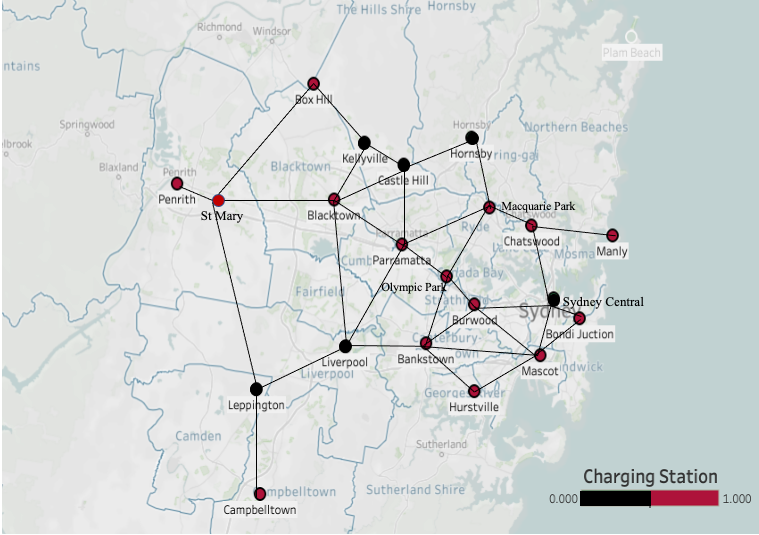

# EV Charging Network Simulation

- A terminal-based application that simulates travel routes of electric vehicles (EVs) in the Sydney metropolitan area.
- This application provides solutions for various EV charging challenges, including finding the nearest or cheapest charging stations and planning optimal travel routes.
- It serves as a practical exercise on the Traveling Salesman Problem (TSP) for EV charging networks, utilizing algorithms like Dijkstra’s for shortest path calculations.

## Road network of Sydney metropolitan area



### Map Representation

The Sydney road network is represented as a **weighted graph**. This graph structure includes:

- **Nodes (Locations)**: Each location, whether it has a charging station or not, is a node in the graph.
- **Edges (Roads)**: Roads connecting locations are represented as edges between nodes.
- **Adjacency Matrix with Weights**: The distances between directly connected locations are stored in an adjacency matrix. Each entry in this matrix represents the travel cost (or weight) between two locations. If there is no direct connection, the entry is either empty or set to infinity.

The graph is implemented in the `WeightedGraph` class, enabling efficient route planning and cost calculations through algorithms like Dijkstra’s.


## Features
1. Print location information
2. Print adjacency matrix
3. List all charging stations in ascending order of charging price
4. List adjacent charging stations
5. Find the adjacent charging station with the lowest travel & charging cost
6. Find the nearest charging station
7. Find the cheapest charging station other than the current location
8. Find cheapest station between origin and destination: Finds the single charging station along a route that minimizes combined travel and charging costs.
9. Find the best way of charging: Calculates the most cost-effective sequence of charging stops for a trip from start to destination.

## Installation and Usage

### 1. Clone the Repository
```
git clone https://github.com/kengen1/EV-Charging-Network.git
cd EV-Charging-Network
```

### 2. Run the Application

**Option 1**: Compile and run
```
mkdir build
cd build
cmake ..
make
./ev_charging_network
```

**Option 2**: Run the provided executable file
```
./ev_charging_network.exe
```